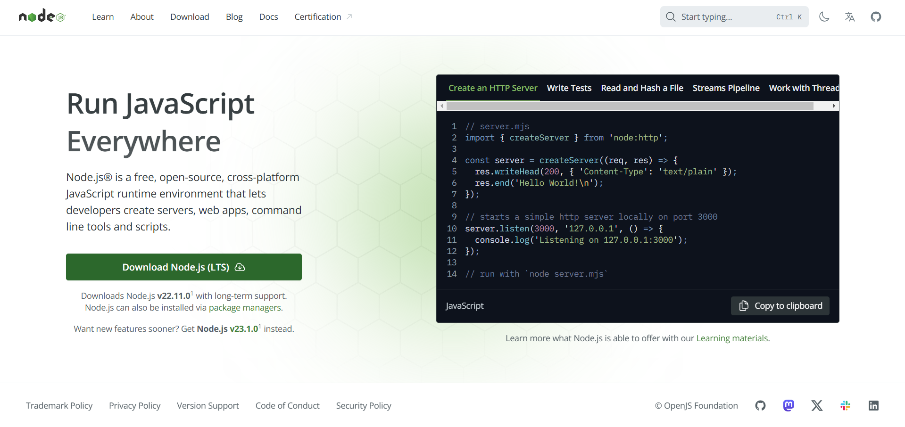
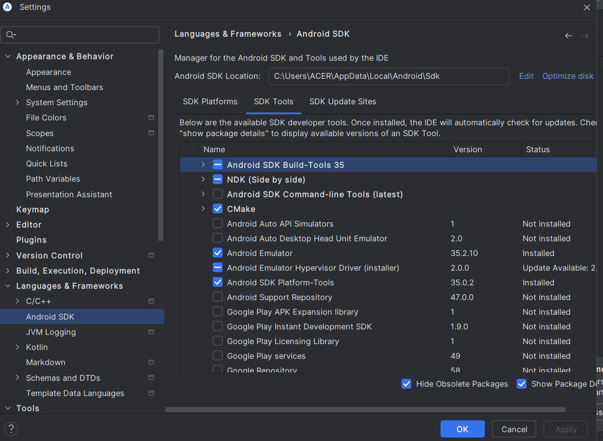

# Acara 7 - Instalasi dan Konfigurasi
## Persiapan
1. Installasi node js LTS https://nodejs.org/dist/v16.13.0/node-v16.13.0-x64.msi
   

2. Instalasi Java Open JDK 17 https://download.java.net/java/GA/jdk17/0d483333a00540d886896a0650ad6915/35/GPL/openjdk-17_windows-x64_bin.zip
   - Ekstrak file zip ke folder `C:\Program Files\Java\jdk-17`
   - Tambahkan path `C:\Program Files\Java\jdk-17\bin` ke environment variable
   - Cek instalasi dengan perintah `java -version`

3. Instalasi Android Studio https://developer.android.com/studio
   - Pilih lokasi instalasi `C:\Program Files\Android\Android Studio`
   - Tambahkan path `C:\Program Files\Android\Android Studio\bin` ke environment variable
   - Buka Android Studio dan ikuti instruksi instalasi
   - Setelah instalasi selesai, buka Android Studio dan buat projek baru
4. Android Studio SDK Platform
   - Buka Android Studio
   - Pilih Configure -> SDK Manager
   - Pilih SDK Platform
   
   - Klik Apply
   - Tunggu proses instalasi selesai
5. Konfigurasi environment variable
   - Buka environment variable
   - Tambahkan variabel `ANDROID_HOME` dengan nilai `C:\Users\<username>\AppData\Local\Android\Sdk`
   - Tambahkan path `%ANDROID_HOME%\platform-tools` ke environment variable
   - Tambahkan path `%ANDROID_HOME%\tools` ke environment variable
   - Tambahkan path `%ANDROID_HOME%\cmdline-tools\latest\bin` ke environment variable
   - Tambahkan path `%ANDROID_HOME%\build-tools\31.0.0` ke environment variable
   lihat https://reactnative.dev/docs/set-up-your-environment

## Membuat Projek
 - Jalankan perintah `npx react-native init <nama_projek>`

## Menjalankan Projek
 - Jalankan perintah `npx react-native run-android`

 